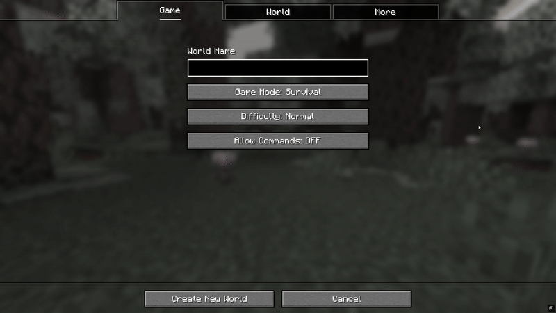

# Hypixel Speed Builders Trainer 
Hypixel Speed Builders trainer. View, practice, and grind time on all of Hypixel's 350+ builds in your own world. Compatible with **Fabric 1.21.1 & Fabric 1.21.4** - More versions to come
## by [ilovelifethankyou](https://discordapp.com/users/633800083678167050) on Discord | `SteveHarvey_IRL` on Hypixel
### Notices
- Requires [World Edit](https://modrinth.com/plugin/worldedit)
  - Version 1.21.1 - `World Edit 7.3.8` [Quick Link](https://modrinth.com/plugin/worldedit/versions?loader=fabric&version=1.21.1#download)
  - Version 1.21.4 - `World Edit 7.3.11` [Quick Link](https://modrinth.com/plugin/worldedit/versions?loader=fabric&version=1.21.4#download)
- Requires [Fabric API](https://modrinth.com/mod/fabric-api)
  - Version 1.21.1 - `Fabric API 0.116.4` [Quick Link](https://modrinth.com/mod/fabric-api?version=1.21.1#download)
  - Version 1.21.4 - `Fabric API 0.119.3` [Quick Link](https://modrinth.com/mod/fabric-api?version=1.21.4#download)
- Not intended for multiplayer functionallity, but you CAN log into servers with it safely just dont use any `/spb` commands
- Extremely easy world setup needed! (`/spb setup`)
### - Builds are formatted with no spaces and no capitals ex: `castleonahill`
### - Command Usage: `/spb grind castleonahill` or `/spb kitchen`
### - [Hypixel Builds Spreadsheet](https://docs.google.com/spreadsheets/d/1fSd1hopLb59BqAY-T0gyVs8ceevx1QD36Xqu-oSHJBA/edit?usp=sharing)

   For any questions, issues, or concerns.

## Features
- **Practice all 350+ Hypixel builds** - All builds as of `August 3rd, 2025` are included
- **Realistic Functionality** - Mimics & Supports Hypixel's features (Including buttons on floor and `90-Degree stair rotation`)
- **Grind Mode** - Skips the build preview and enables replenishing blocks in order to keep practicing your time
- **Time Recorder** - Your times are recorded locally in `spbtrainer.json` within your config folder
- **Customizble Preview Time** - Run `/spb config` to set preview time, default is 5 seconds
- **Customizble Keybinds** - Clear build area `Grave Key` and Restart `F6` are default
- **Advanced Automatic World Setup** - Instantly setup your world with `/spb setup`
- **Custom Builds Support** - Create and practice your own builds
- **Randomized Layout** - Builds with set hotbars will be added soon ex:`colors` or `painting vertical`

### `Buildmode` - Creative powers with limited blocks, also restricts breaking and placing blocks outside of the platform
### `Grindmode` - Skips the build preview and enables replenishing blocks in order to keep practicing your time

## Commands
- `/spb config` - Shows configuration in chat with interactable buttons
- `/spb <build>` - Loads a build with a preview, then allows for building. Essentially a SPB Round
- `/spb grind <build>` - Enables grind mode, which skips the previews, and automatically replenishes blocks in order to practice
- `/spb stop` - Stops all previews and clears build region and inventory
- `/spb reset` - Resets/clears the build area
  Default keybind `Grave Key`
- `/spb restart` - Resets/clears the build, area, replenishes blocks, and begins a countdown to try again
  Default keybind `f6`
- `/spb setup` - Set's up the world for the mod, make sure you're in a superflat world with the void preset, and commands enabled!
- `/spb create <build>` - Creates a custom build for whatever is on the platform
- `/spb delete <build>` - Deletes your custom build
- `/spb list` - Shows your custom builds
- `/spb area` - Displays a message containing the build area
- `/spb time <build>` - Displays your best recorded time for the build
  `/spb time reset <build>` - Resets the recorded time for a build
- `/spb view <build>` - Places the complete build for learning
- `/spb buildmode <on/off>` - Toggles buildmode
- `/spb help` - Shows this!

-   For any questions, issues, or concerns.

# World Setup
**Superflat with `The Void` preset. Once you're in your world run `/spb setup`**

# Known Issues
- Signs don't leave inventory on `bus` build
- Builds such as `colors` don't have set hotbars
- Hard build `torch` is missing

# Coming soon
- `/spb game` - Mimics a game of SPB, 2 simple, 2, easy, medium, hard, insane
- Set hotbars for builds

# Testers and Thanks
- Thank you [dix0o](https://discordapp.com/users/775037062247350272) on Discord | `SAL4F` on Hypixel for providing many of the builds!
- Thanks [aembr](https://discordapp.com/users/170692060158885889) on Discord | `Yria` on Hypixel for creating a beautiful README that inspired this one, and for the amazing [GuessTheUtils](https://modrinth.com/mod/guesstheutils) mod!
- HanaHippo on Hypixel
## TO-DO LIST
 - Preview Video
 - Hypixel Builds Spreadsheet
 - Notable Builds within spreadsheet
